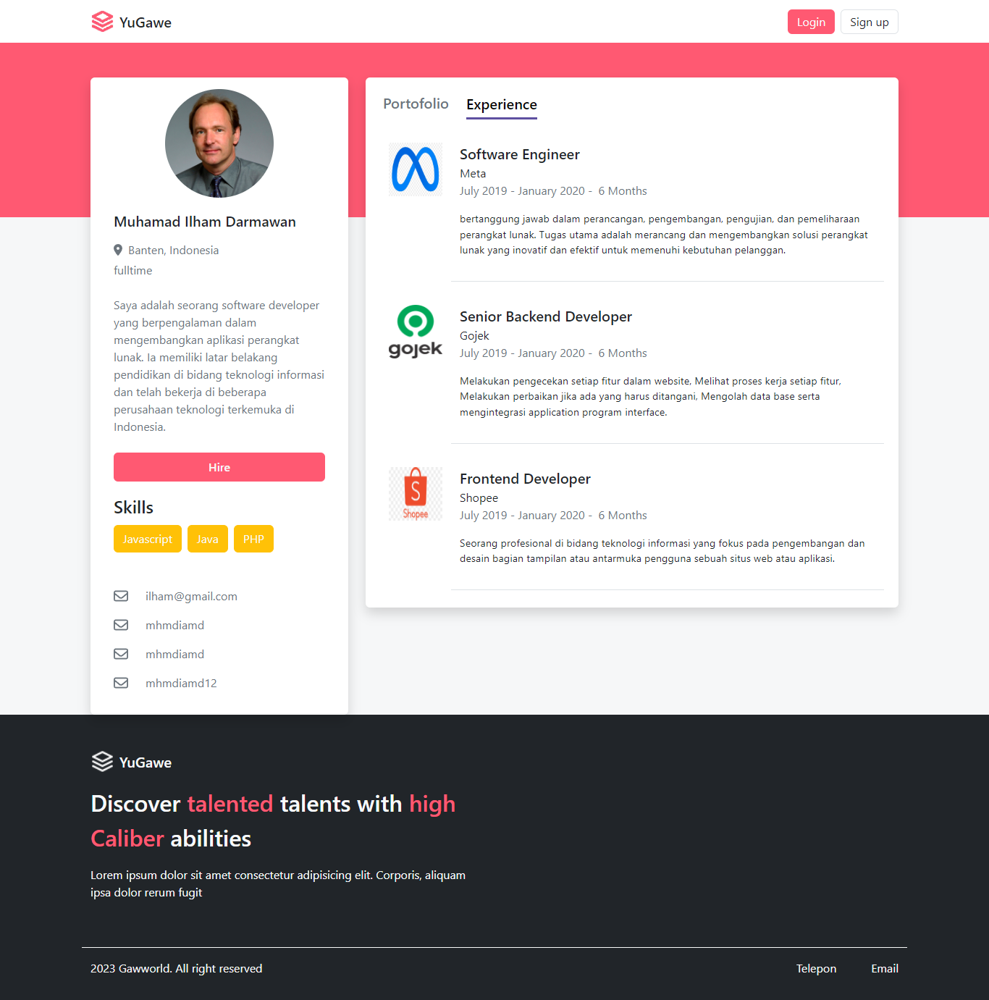

<p align="center">
<div align="center">
  
</div>
  <h3 align="center">Hiring App App</h3>
  <p align="center">
    <a href="https://github.com/mhmdiamd/ui-hiring-app"><strong>Explore the docs »</strong></a>
    <br />
    <a href="https://yugawe.vercel.app/">View Demo</a>
    <br />
    <a href="https://restapi-hiring-app-pijarcamp-production.up.railway.app/api/v1/">Api Demo</a>
  </p>
</p>

<!-- TABLE OF CONTENTS -->

## Table of Contents

- [Table of Contents](#table-of-contents)
- [About The Project](#about-the-project)
  - [Built With](#built-with)
- [Getting Started](#getting-started)
  - [Prerequisites](#prerequisites)
  - [Installation](#installation)
  - [Setup .env](#setup-env)
- [Screenshots](#screenshots)
- [Contributing](#contributing)
- [Related Project](#related-project)
- [Contact](#contact)

<!-- ABOUT THE PROJECT -->

## About The Project

YuGawe is a jobseeker website project that aims to assist Software Developers in finding jobs that match their skills. The name YuGawe comes from the Javanese language, meaning "Let's Work".

On this website, job seekers can create a profile, upload their experience and portfolio. YuGawe also offers a feature to connect job seekers with companies that are looking for candidates with the required skills.

One of the outstanding features of YuGawe is the ability to identify the skills and interests of job seekers based on their abilities. With this information, recruiters can directly connect through the hire feature.

<!-- GETTING STARTED -->

## Getting Started

### Prerequisites

This is an example of how to list things you need to use the software and how to install them.

- [nodejs](https://nodejs.org/en/download/)
- [Bootstrap Css](https://getbootstrap.com/)
- [Next JS](https://nextjs.org/)
- [Redux](https://redux.js.org/)

### Installation

- Clone This Front End Repo

```
git clone https://github.com/mhmdiamd/ui-hiring-app
```

- Go To Folder Repo

```
cd ui-hiring-app
```

- Install Module

```
npm install
```

- Setup .env
```
npm run dev
```

### Setup .env

Create .env.local file in your root project folder.

```
NEXT_PUBLIC_BASE_URL_ENDPOINT = [BACKEND_URL]
```

<!-- ROADMAP -->

## Screenshots

<table>
 <tr>
    <td></td>
    <td> </td>
  </tr>
   <tr>
    <td>Recruiter Register</td>
    <td>Worker Register</td>
  </tr>
  
  <tr>
    <td></td>
    <td> </td>
  </tr>
   <tr>
    <td>Landing Page</td>
    <td>Worker Profile</td>
  </tr>

  <tr>
    <td></td>
    <td> </td>
  </tr>
   <tr>
    <td>Worker experience</td>
    <td>Worker portofolio</td>
  </tr>

  <tr>
    <td></td>
    <td></td>
  </tr>
   <tr>
    <td>Worker List</td>
    <td>Update Recruiter</td>
  </tr>

  <tr>
    <td></td>
    <td></td>
  </tr>
   <tr>
    <td>Worker List</td>
    <td>Email Activation</td>
  </tr>

</table>
<!-- CONTRIBUTING -->

## Contributing

Contributions are what make the open source community such an amazing place to be learn, inspire, and create. Any contributions you make are **greatly appreciated**.

1. Fork the Project
2. Create your Feature Branch (`git checkout -b feature/AmazingFeature`)
3. Commit your Changes (`git commit -m 'Add some AmazingFeature'`)
4. Push to the Branch (`git push origin feature/AmazingFeature`)
5. Open a Pull Request

## Related Project

:rocket: [`Backend Hiring App`](https://github.com/mhmdiamd/restapi-hiring-app-pijarcamp)

:rocket: [`Frontend Hiring App`](https://github.com/mhmdiamd/ui-hiring-app)

:rocket: [`Demo Hiring App`](https://yugawe.vercel.app/)

Project Link: [https://github.com/mhmdiamd/ui-hiring-app](https://github.com/mhmdiamd/ui-hiring-app)